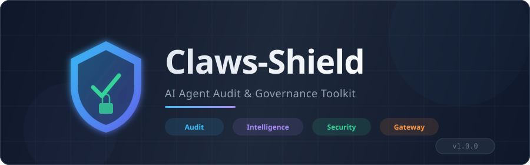
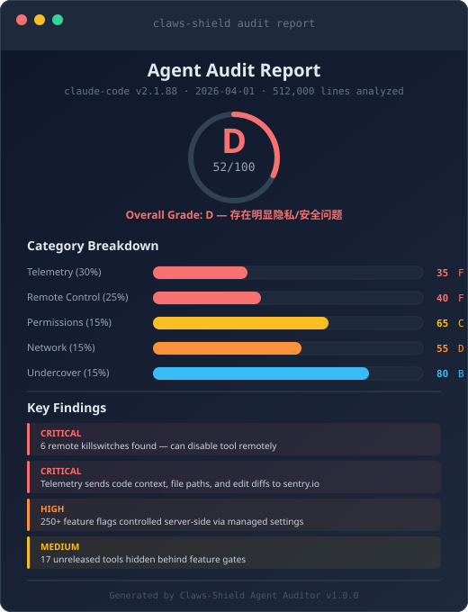
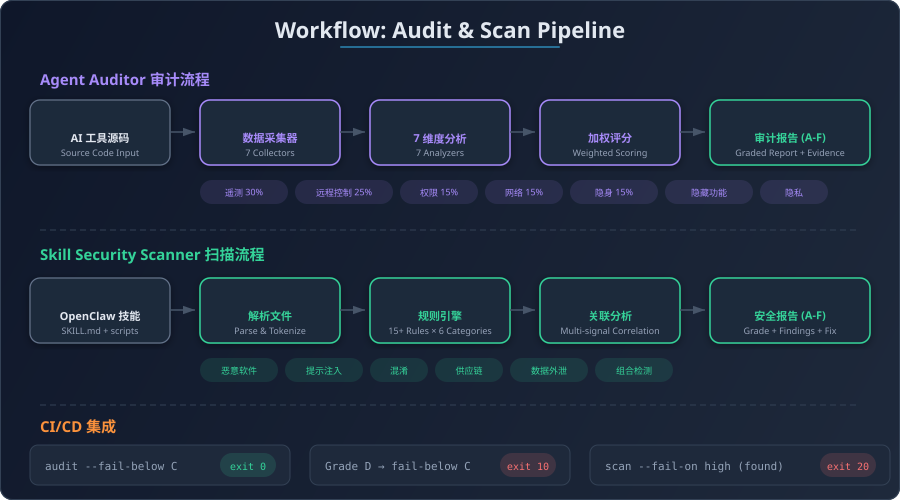
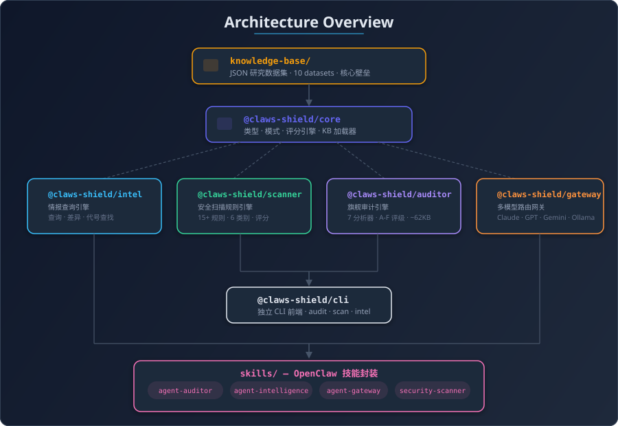

<div align="center">



<br/>

**全球最强大的 AI Agent 审计与治理工具包**

[](LICENSE)
[](https://www.typescriptlang.org/)
[](https://nodejs.org/)
[](https://pnpm.io/)
[](https://clawhub.ai/MackDing)
[](https://github.com/Claws-ZH/claws-shield/actions/workflows/ci.yml)

[English](./README_EN.md) | **中文**

<br/>

> 源自对 Claude Code v2.1.88（512K 行 TypeScript）的深度逆向工程分析。
> 现已支持审计**任意** AI 编码工具。

</div>

---

## 目录

- [什么是 Claws-Shield？](#什么是-claws-shield)
- [核心工具](#核心工具)
- [快速开始](#快速开始)
- [审计报告](#审计报告)
- [安全扫描规则](#安全扫描规则)
- [知识库](#知识库)
- [项目架构](#项目架构)
- [CI/CD 集成](#cicd-集成)
- [开发指南](#开发指南)
- [隐私声明](#隐私声明)
- [贡献](#贡献)
- [许可证](#许可证)

---

## 什么是 Claws-Shield？

AI 编码助手正在成为开发者的标配工具，但你真的了解它们在背后做了什么吗？

Claws-Shield 是一个包含 **4 个核心工具** 的 monorepo，旨在为 AI 编码代理带来**透明度**和**安全性**。无论你是想审计 AI 工具的隐私行为，还是在安装 OpenClaw 技能前进行安全扫描，Claws-Shield 都能帮到你。

## 核心工具

| 工具 | 描述 | ClawHub |
|:-----|:-----|:--------|
| **Agent Auditor** | 审计任意 AI 工具的遥测、远程控制、权限、隐私和隐藏功能，生成 A-F 等级报告 | [`agent-auditor`](https://clawhub.ai/MackDing/agent-auditor) |
| **Agent Intelligence** | 基于研究的情报数据库，包含 250+ 功能开关、模型代号、隐藏功能和版本差异 | [`agent-intelligence`](https://clawhub.ai/MackDing/agent-intelligence) |
| **Skill Security Scanner** | 扫描 OpenClaw 技能中的恶意软件、提示注入、混淆、供应链攻击和数据外泄 | [`claws-security-scanner`](https://clawhub.ai/MackDing/claws-security-scanner) |
| **Agent Gateway** | 多模型智能路由（Claude、GPT、Gemini、Ollama），支持成本优化和故障自动转移 | [`agent-gateway`](https://clawhub.ai/MackDing/agent-gateway) |

## 快速开始

### 方式一：CLI 独立使用

```bash
# 审计 AI 工具源码
npx @claws-shield/cli audit ./path-to-ai-tool-source

# 扫描技能安全性
npx @claws-shield/cli scan ./path-to-skill

# 查询情报数据库
npx @claws-shield/cli intel "capybara codename"

# 启动多模型网关
npx @claws-shield/cli gateway --port 8787
```

### 方式二：OpenClaw 技能一键安装

```bash
clawhub install agent-auditor
clawhub install agent-intelligence
clawhub install claws-security-scanner
clawhub install agent-gateway
```

### 方式三：编程调用

```typescript
import { runAudit, formatMarkdown } from "@claws-shield/auditor"
import { scanSkill } from "@claws-shield/scanner"
import { loadIntelDatabase, searchAll } from "@claws-shield/intel"
import { Router, ProviderRegistry } from "@claws-shield/gateway"

// 审计 AI 工具
const report = await runAudit("./claude-code-source")
console.log(formatMarkdown(report))

// 扫描技能安全问题
const scan = await scanSkill("./my-skill")
console.log(scan.securityGrade) // "A"

// 查询情报数据库
const db = loadIntelDatabase()
const results = searchAll(db, "telemetry")

// 智能路由 LLM 请求
const registry = new ProviderRegistry()
const router = new Router(registry)
const response = await router.route({
  messages: [{ role: "user", content: "你好" }]
}, "cheapest")
```

## 审计报告

<div align="center">

</div>

<br/>

Agent Auditor 生成全面的审计报告，包含：

- **总体等级**（A-F）和分数（0-100）
- **7 个分析维度**：遥测、远程控制、隐身模式、权限、网络、隐藏功能、隐私
- **证据链** — 包含源代码精确位置
- **可操作的修复建议**

### 评分权重

| 维度 | 权重 | 说明 |
|:-----|:-----|:-----|
| 遥测 | 30% | 数据收集行为和上报端点 |
| 远程控制 | 25% | 远端开关、受管设置、杀开关 |
| 权限 | 15% | 文件系统/网络/进程权限请求 |
| 网络 | 15% | 出站连接和数据传输 |
| 隐身模式 | 15% | 署名抹除和来源伪装 |

### 等级标准

| 等级 | 分数 | 含义 |
|:-----|:-----|:-----|
| **A** | 90-100 | 优秀 — 隐私保护完善 |
| **B** | 80-89 | 良好 — 存在少量可接受的数据收集 |
| **C** | 65-79 | 一般 — 发现值得关注的行为 |
| **D** | 50-64 | 较差 — 存在明显的隐私/安全问题 |
| **F** | 0-49 | 危险 — 发现严重隐患 |

## 安全扫描规则

<div align="center">

</div>

<br/>

15+ 检测规则，覆盖 6 个类别：

| 类别 | 检测项 |
|:-----|:-------|
| **恶意软件** | 可疑 shell 命令、凭证窃取 |
| **提示注入** | 指令覆盖、权限绕过 |
| **混淆** | Base64 编码命令、charcode 技巧 |
| **供应链** | 不安全的 postinstall 脚本、未固定依赖版本 |
| **数据外泄** | 携带敏感数据的出站请求、环境变量转储 |
| **组合检测** | 多信号攻击模式关联分析 |

## 知识库

情报数据库基于深度逆向工程分析构建，包含 10 个核心数据集：

| 数据集 | 内容 |
|:-------|:-----|
| `telemetry/endpoints.json` | 已知数据收集端点 |
| `telemetry/metadata-fields.json` | 遥测元数据字段 |
| `flags/feature-flags.json` | 250+ 已解码的 `tengu_*` 功能开关 |
| `flags/killswitches.json` | 6 个远程控制机制 |
| `codenames/models.json` | Capybara、Tengu、Fennec、Numbat 等代号映射 |
| `remote-control/managed-settings.json` | 轮询基础设施和受管设置 |
| `undercover/activation-rules.json` | 署名抹除和隐身规则 |
| `hidden-features/unreleased-tools.json` | 17+ 个功能门控后的未发布工具 |
| `baselines/privacy-grading.json` | 隐私评级基线 |
| `baselines/security-grading.json` | 安全评级基线 |

## 项目架构

<div align="center">

</div>

```
claws-shield/
├── knowledge-base/          # JSON 研究数据集（核心壁垒）
├── packages/
│   ├── core/                # 共享类型、模式、评分引擎、KB 加载器
│   ├── intel/               # 情报查询引擎
│   ├── scanner/             # 安全扫描规则引擎
│   ├── auditor/             # 旗舰审计引擎（7 个分析器）
│   └── gateway/             # 多模型路由网关
├── apps/
│   └── cli/                 # 独立 CLI 工具
├── skills/                  # 4 个 OpenClaw 技能封装
│   ├── agent-auditor/
│   ├── agent-gateway/
│   ├── agent-intelligence/
│   └── skill-security-scanner/
└── scripts/                 # 构建与验证脚本
```

### 包一览

| 包 | 描述 | 大小 |
|:---|:-----|:-----|
| `@claws-shield/core` | 共享类型、评分引擎、KB 加载器 | ~5KB |
| `@claws-shield/intel` | 情报查询引擎 | ~15KB |
| `@claws-shield/scanner` | 安全扫描规则引擎 | ~20KB |
| `@claws-shield/auditor` | 旗舰审计引擎（7 个分析器） | ~62KB |
| `@claws-shield/gateway` | 多模型路由网关 | ~25KB |
| `@claws-shield/cli` | 独立 CLI 前端 | ~6KB |

## CI/CD 集成

在你的 CI 流水线中使用：

```bash
# 审计等级低于 C 时失败
npx @claws-shield/cli audit ./source --fail-below C --score-only

# 发现高危扫描结果时失败
npx @claws-shield/cli scan ./my-skill --fail-on high
```

退出码：

| 退出码 | 含义 |
|:-------|:-----|
| `0` | 成功 |
| `1` | 错误 |
| `10` | 审计等级低于阈值 |
| `20` | 扫描发现超过严重度阈值的问题 |

## 开发指南

### 环境要求

- Node.js >= 20.0.0
- pnpm 9.15+

### 本地开发

```bash
# 克隆仓库
git clone https://github.com/Claws-ZH/claws-shield.git
cd claws-shield

# 安装依赖
pnpm install

# 构建所有包
pnpm turbo build

# 运行测试
pnpm vitest run

# 测试覆盖率
pnpm vitest run --coverage

# 代码检查
pnpm biome check .

# 开发模式（监听变更）
pnpm turbo dev
```

### 知识库验证

```bash
# 验证 KB 数据完整性
pnpm kb:validate

# 打包技能
pnpm skills:pack

# 检查技能包大小
pnpm skills:sizecheck
```

## 隐私声明

Claws-Shield 以隐私为核心设计原则：

- **所有分析均在本地完成** — 不向外部服务器发送任何数据
- **零遥测** — 我们不收集任何使用数据
- **不存储 API 密钥** — Gateway 密钥仅保留在你的本地环境中
- **完全开源** — 代码完全可审计

## 贡献

欢迎贡献！请参阅 [CONTRIBUTING.md](CONTRIBUTING.md) 了解详细指南。

我们接受中文和英文的 Issue 与 PR。

## 许可证

[MIT](LICENSE) &copy; 2026 Claws-Shield Contributors

---

<div align="center">

**以透明为本。** 如果 AI 工具能审计你的代码，你难道不应该能审计它吗？

</div>
